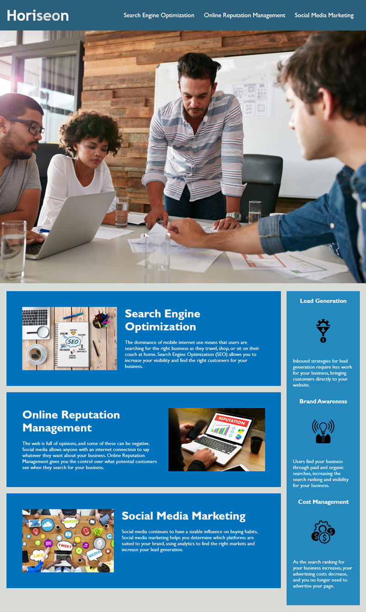

# Code Refactor Horiseon Webpage
Refactoring code for an existing website to improves its accessibility.

## Description
The goal of creating this Code Refactor Horiseon page is to help new students get familiar with organizing both HTML and CSS layouts.This is accomplished by using semantic elements,grouping elements together, and adding attributes to achieve a concise and comprehnsible format.

## Technologies Used
Front-End technologies such as HTML and CSS.

## Screenshots
Finished webpage should look like this:

